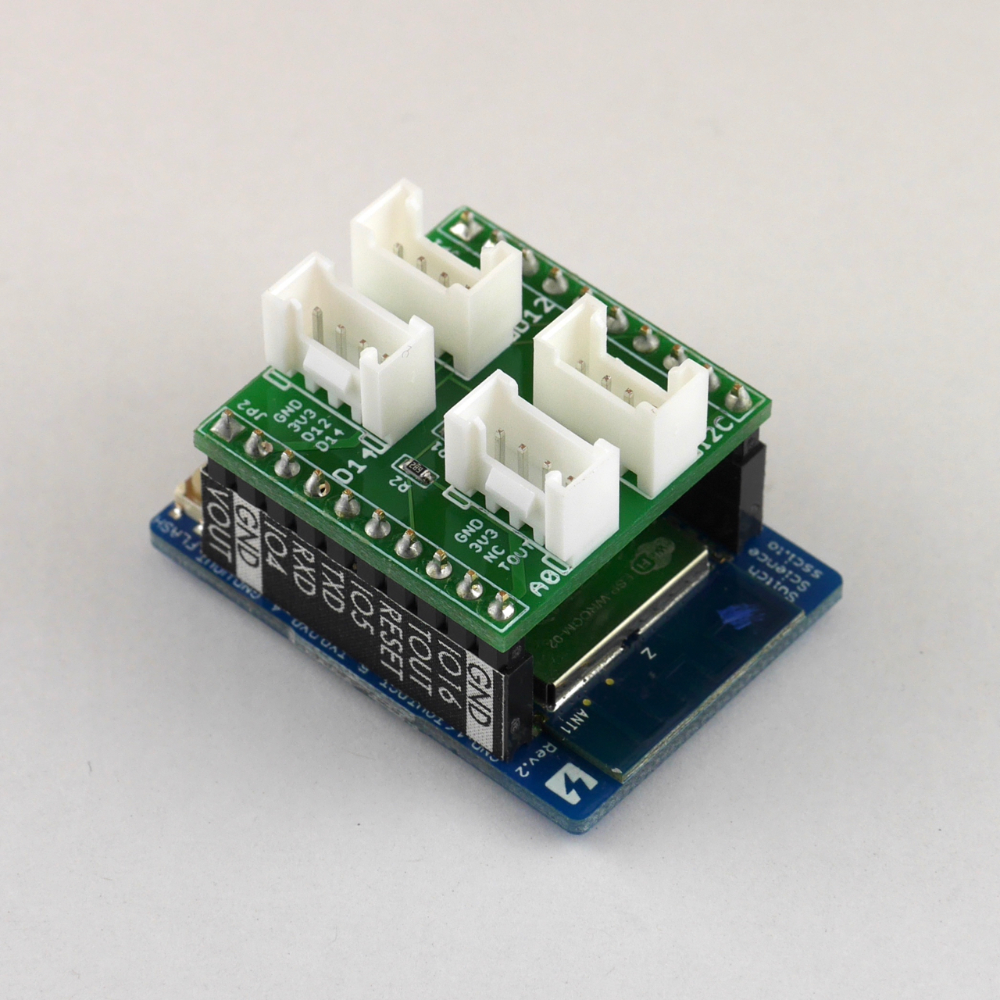
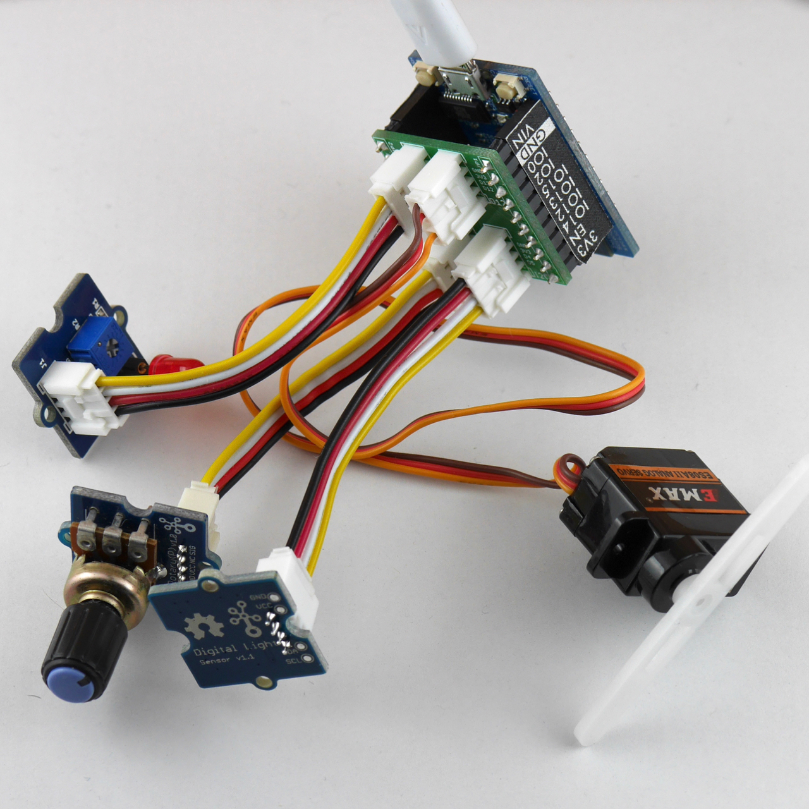

# Grove Base for ESPr Developer

A bridge between the [**Grove**](http://www.seeedstudio.com/wiki/Category:Grove) family by the Seeed Studio and [ESPr Developer](https://www.switch-science.com/catalog/2652/) by the Switch Science.

## Bill of Materials

|Part/Designator|Manufacture Part Number/Seeed SKU|Quantity|
|---------------|---------------------------------|--------|
|PCB||1|
|J1,J2,J3,J4|Seeed SKU: [320110033](http://www.seeedstudio.com/depot/index.php?main_page=opl_info&opl_id=4)|4|
|JP1|Digi-Key: [S9200-ND](http://www.digikey.com/product-search/en?keywords=952-1842-ND)|2|
|R1|Digi-Key: [P220KDBCT-ND](http://www.digikey.com/product-search/en?keywords=P220KDBCT-ND)|1|
|R2|Digi-Key: [P100KDBCT-ND](http://www.digikey.com/product-search/en?keywords=P100KDBCT-ND)|1|

## Compatible Grove Modules

* Sensors
  * [Grove - Button](http://www.seeedstudio.com/wiki/Grove_-_Button)
  * [Grove - Switch(P)](http://www.seeedstudio.com/wiki/Grove_-_Switch(P))
  * [Grove - Rotary Angle Sensor](http://www.seeedstudio.com/wiki/Grove_-_Rotary_Angle_Sensor)
  * [Grove - Slide Potentiometer](http://www.seeedstudio.com/wiki/Grove_-_Slide_Potentiometer)
  * [Grove - Touch Sensor](http://www.seeedstudio.com/wiki/Grove_-_Touch_Sensor)
  * [Grove - Light Sensor](http://www.seeedstudio.com/wiki/Grove_-_Light_Sensor)
  * [Grove - Single Axis Analog Gyro](http://www.seeedstudio.com/wiki/Grove_-_Single_Axis_Analog_Gyro)
  * [Grove - 3-Axis Digital Accelerometer (±16g)](http://www.seeedstudio.com/wiki/Grove_-_3-Axis_Digital_Accelerometer(%C2%B116g))
* Actuators
  * [Grove - LED Socket Kit](http://www.seeedstudio.com/wiki/Grove_-_LED)
  * [Grove - Buzzer](http://www.seeedstudio.com/wiki/Grove_-_Buzzer)
  * [Grove - Vibration Motor](http://www.seeedstudio.com/wiki/Grove_-_Vibration_Motor)
  * [Grove - Servo](http://www.seeedstudio.com/wiki/Grove_-_Servo)

## How to 'compile'?

Place an order at the [Fusion PCBA prototype](http://www.seeedstudio.com/service/index.php?r=pcb) service.

# License Information

This design document is licensed by Shigeru Kobayashi under the terms of the [Creative Commons Attribution-ShareAlike 4.0 International Public License](http://creativecommons.org/licenses/by-sa/4.0/).
